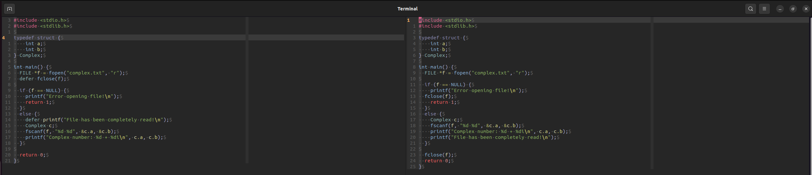

# What is Defersify?

Defersify is supposed to be a simple tool to extend the feature of the "defer" keyword found in GoLang to other languages. At present moment the only language supported is C.

# Before and After Examples

In the following image you can see on the left hand side a c file (that wouldn't compile) with convenient commands to defer tasks - particularly the closing of a file. On the right hand side you can see the same file after running the defersify tool. The tool has added the necessary code to close the file at relevant places.

 

The tool operates with a "deferStack" that tracks the level of nest within a function where a defer executs

# Basic Usage

Simply make sure any file that you want to be subject to this tool has a name that starts with "deferable_". Then run the tool in your build script. The output will have truncated the "deferable_" prefix out, so in your make file you can reference the more normal filename. 

... more documentation coming soon...
