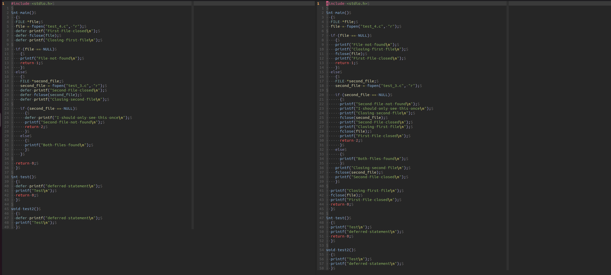

# Disclaimer of Public-ness

I don't normally make repo's public. But, this is at a state where I'd like it to be public. But I'm not necessarily broadcasting it's existence to the world. There are improvements I'd like to make - but it seems to be functional. We'll call this a soft launch while I make it accessible to the public, but don't try to shill it out to pad my resume.

# What is Defersify?

Defersify is supposed to be a simple tool to extend the feature of the "defer" keyword found in GoLang to other languages. At present moment the only language supported is C. (I've added .cpp and .cc as supported extensions... but I don't like c++ so... I have no pland of testing it.)

# Before and After Examples

In the following image you can see on the left hand side a c file with convenient commands to defer tasks - particularly the closing of a file. On the right hand side you can see the same file after running the defersify tool. The tool has added the necessary code to close the file at relevant places.

 

Running this tool at the start of your build process would allow you to take advantage of the convenience of the defer keyword in GoLang in your C code, while being able to write your lower level/performant code in C.

# Basic Usage

Simply make sure any file that you want to be subject to this tool has a name that starts with "deferable_". Then run the tool in your build script. The output will have truncated the "deferable_" prefix out, so in your make file you can reference the more normal filename. 

When you run `./defersify` it will look for all c file that start with "deferable_" and output the modified files in the same directory.

There are some flags - those have yet to be implemented in an meaningful way.

# Why write a tool to extend a GoLang feature to C using GoLang?

3 factors were the most influential in my decision to write this tool in GoLang:

1. GoLang is VERY simple to build with various platforms. This is my first public project of note. I wanted to make sure that it was easy for people spin up for the architecture they are using. GoLang simplifies this process to a degree that I think is unmatched by other languages.
2. The regexp and flag libraries expedited the development of this tool, and too many of my projects are private for moving too slowly to feel comfortable sharing.
3. I'm familiar with C (it's my favorite and why I wanted the defer keyword for c), and I think GoLang is a nice language to add to my repetoire. This project served as practice. 

# Upcoming Changes

* I want to implement a verbose mode. The flag is already there, but I've not setup any real printing yet. 

* Testing needs to be done for "block defers". I don't want users using them (my opinion). Support exists, but a block defer should load into the stack differently than single statements, and no logic has been implemented to handle this. (despite checks for block defers being written into the code)

* I put a function in to make the output look "pretty" but, it's kind of specific to my formatting preferences. I'd like to improve this because I think the output file looking familiar will make debuggind easier for the user - especially since the user will need to debug the output of this tool. 
